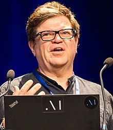

<table class="infobox biography vcard">
<tbody>
<tr>
<th colspan="2">

Yann LeCun

</th>
</tr>
<tr>
<td colspan="2">

Yann LeCun in 2018

</td>
</tr>
<tr>
<th scope="row">Born</th>
<td>July 8, 1960&nbsp;(age&nbsp;60) 

<a title="Soisy-sous-Montmorency" href="https://en.wikipedia.org/wiki/Soisy-sous-Montmorency">Soisy-sous-Montmorency</a>,&nbsp;<a title="France" href="https://en.wikipedia.org/wiki/France">France</a>

</td>
</tr>
<tr>
<th scope="row">Alma&nbsp;mater</th>
<td><a title="ESIEE Paris" href="https://en.wikipedia.org/wiki/ESIEE_Paris">ESIEE Paris</a>&nbsp;(MSc) <a title="Pierre and Marie Curie University" href="https://en.wikipedia.org/wiki/Pierre_and_Marie_Curie_University">Pierre and Marie Curie University</a>&nbsp;(PhD)</td>
</tr>
<tr>
<th scope="row">Known&nbsp;for</th>
<td><a title="Deep learning" href="https://en.wikipedia.org/wiki/Deep_learning">Deep learning</a></td>
</tr>
<tr>
<th scope="row">Awards</th>
<td><a title="Turing Award" href="https://en.wikipedia.org/wiki/Turing_Award">Turing Award</a>&nbsp;(2018) <a title="AAAI Fellow" href="https://en.wikipedia.org/wiki/AAAI_Fellow">AAAI Fellow</a>&nbsp;(2019) <a title="Legion of Honour" href="https://en.wikipedia.org/wiki/Legion_of_Honour">Legion of Honour</a>&nbsp;(2020)</td>
</tr>
<tr>
<td colspan="2"><strong>Scientific career</strong></td>
</tr>
<tr>
<th scope="row">Institutions</th>
<td><a title="Bell Labs" href="https://en.wikipedia.org/wiki/Bell_Labs">Bell Labs</a>&nbsp;(1988-1996) <a title="New York University" href="https://en.wikipedia.org/wiki/New_York_University">New York University</a> <a title="Facebook" href="https://en.wikipedia.org/wiki/Facebook">Facebook</a></td>
</tr>
<tr>
<th scope="row"><a title="Thesis" href="https://en.wikipedia.org/wiki/Thesis">Thesis</a></th>
<td><em>Mod&egrave;les connexionnistes de l'apprentissage (connectionist learning models)</em>&nbsp;(1987a)</td>
</tr>
<tr>
<th scope="row"><a title="Doctoral advisor" href="https://en.wikipedia.org/wiki/Doctoral_advisor">Doctoral advisor</a></th>
<td>Maurice Milgram</td>
</tr>
<tr>
<th scope="row">Website</th>
<td><a class="external text" href="http://yann.lecun.com/" rel="nofollow">yann<wbr />.lecun<wbr />.com</a></td>
</tr>
</tbody>
</table>
 

<strong>Yann Andr&eacute; LeCun</strong>&nbsp;(<a title="Help:IPA/English" href="https://en.wikipedia.org/wiki/Help:IPA/English">/ləˈkʌn/</a>&nbsp;<small>French pronunciation:&nbsp;</small><a title="Help:IPA/French" href="https://en.wikipedia.org/wiki/Help:IPA/French">[ləkɛ̃]</a>;&nbsp;originally spelled Le Cun;&nbsp;born July 8, 1960) is a French&nbsp;<a title="Computer scientist" href="https://en.wikipedia.org/wiki/Computer_scientist">computer scientist</a>&nbsp;working primarily in the fields of&nbsp;<a title="Machine learning" href="https://en.wikipedia.org/wiki/Machine_learning">machine learning</a>,&nbsp;<a title="Computer vision" href="https://en.wikipedia.org/wiki/Computer_vision">computer vision</a>,&nbsp;<a class="mw-redirect" title="Mobile robotics" href="https://en.wikipedia.org/wiki/Mobile_robotics">mobile robotics</a>, and&nbsp;<a title="Computational neuroscience" href="https://en.wikipedia.org/wiki/Computational_neuroscience">computational neuroscience</a>. He is the Silver Professor of the&nbsp;<a title="Courant Institute of Mathematical Sciences" href="https://en.wikipedia.org/wiki/Courant_Institute_of_Mathematical_Sciences">Courant Institute of Mathematical Sciences</a>&nbsp;at&nbsp;<a title="New York University" href="https://en.wikipedia.org/wiki/New_York_University">New York University</a>, and Vice President, Chief AI Scientist at&nbsp;<a title="Facebook" href="https://en.wikipedia.org/wiki/Facebook">Facebook</a>.

He is well known for his work on&nbsp;<a title="Optical character recognition" href="https://en.wikipedia.org/wiki/Optical_character_recognition">optical character recognition</a>&nbsp;and&nbsp;<a title="Computer vision" href="https://en.wikipedia.org/wiki/Computer_vision">computer vision</a>&nbsp;using&nbsp;<a title="Convolutional neural network" href="https://en.wikipedia.org/wiki/Convolutional_neural_network">convolutional neural networks</a>&nbsp;(CNN), and is a founding father of convolutional nets.&nbsp;He is also one of the main creators of the&nbsp;<a title="DjVu" href="https://en.wikipedia.org/wiki/DjVu">DjVu</a>&nbsp;image compression technology (together with&nbsp;<a title="L&eacute;on Bottou" href="https://en.wikipedia.org/wiki/L%C3%A9on_Bottou">L&eacute;on Bottou</a>&nbsp;and Patrick Haffner). He co-developed the Lush programming language with L&eacute;on Bottou.

He is co-recipient of the 2018&nbsp;<a title="Turing Award" href="https://en.wikipedia.org/wiki/Turing_Award">ACM A.M. Turing Award</a>&nbsp;for his work in deep learning.

LeCun - together with&nbsp;<a title="Geoffrey Hinton" href="https://en.wikipedia.org/wiki/Geoffrey_Hinton">Geoffrey Hinton</a>&nbsp;and&nbsp;<a title="Yoshua Bengio" href="https://en.wikipedia.org/wiki/Yoshua_Bengio">Yoshua Bengio</a>&nbsp;- are referred to by some as the "Godfathers of AI" and "Godfathers of Deep Learning".

 

<h2> 5 Groundbreaking Yann Lecun Papers  </h2>

<ul>

                             

 <li><a target="_blank" href="https://github.com/manjunath5496/5-Groundbreaking-Yann-Lecun-Papers/blob/master/lecun(1).pdf" style="text-decoration:none;">Generalization And Network Design Strategies</a></li>

 <li><a target="_blank" href="https://github.com/manjunath5496/5-Groundbreaking-Yann-Lecun-Papers/blob/master/lecun(2).pdf" style="text-decoration:none;">Back-propagation Applied to Handwritten Zip Code Recognition</a></li>

<li><a target="_blank" href="https://github.com/manjunath5496/5-Groundbreaking-Yann-Lecun-Papers/blob/master/lecun(3).pdf" style="text-decoration:none;">Gradient-based Learning Applied To Document Recognition</a></li>
 <li><a target="_blank" href="https://github.com/manjunath5496/5-Groundbreaking-Yann-Lecun-Papers/blob/master/lecun(4).pdf" style="text-decoration:none;">Efficient Back-prop</a></li>                              
<li><a target="_blank" href="https://github.com/manjunath5496/5-Groundbreaking-Yann-Lecun-Papers/blob/master/lecun(5).pdf" style="text-decoration:none;">Convolutional Networks For Images, Speech, And Time Series</a></li>

 </ul>
